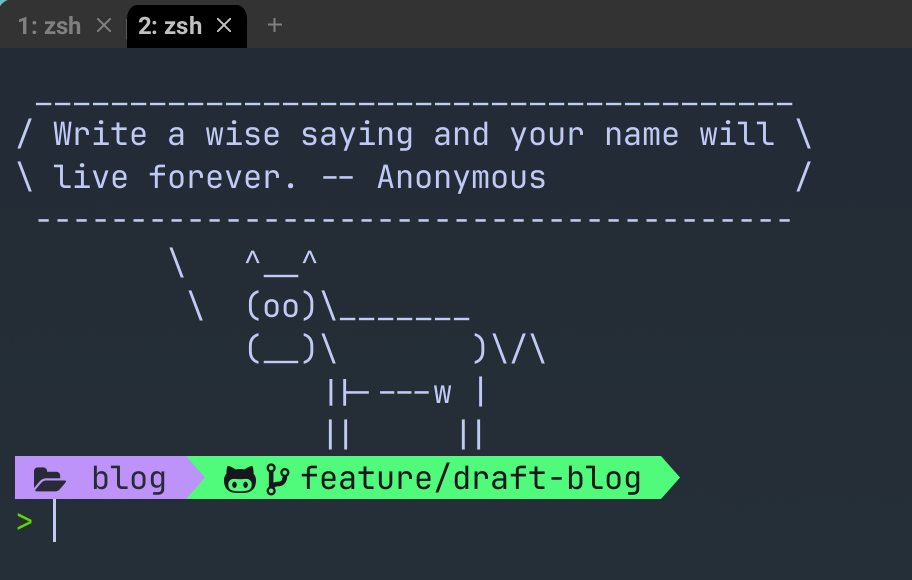
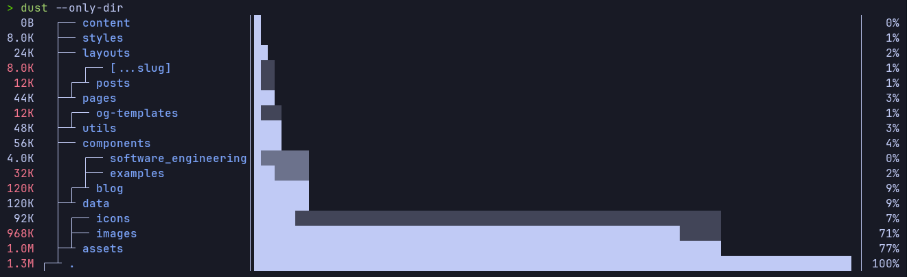

<figure class="mx-auto w-1/2">
  
  <figcaption class="text-center"></figcaption>
</figure>

## Overview

I still remember my early days as a data scientist/engineer, using the default MacOS terminal and fighting my way through the command line. `cd` and `ls` were my best friends, and I had no idea how to make the most of my terminal.

It took many years for me to find the time to properly explore how best to make use of my terminal. Procrastination and a lack of understanding always get in the way, but I finally took the plunge and started to explore the world of terminal plugins. I was amazed at how much they could enhance my productivity and make my life easier.

These are just a few of my favourite terminal plugins that I interact with on a daily basis. For how simple some of them are, they have a huge impact on my productivity and the way I interact with my terminal.

## My Favourite Terminal Plugins

### 1. [WezTerm](https://wezfurlong.org/wezterm/)

> WezTerm is a powerful cross-platform terminal emulator and multiplexer written by @wez and implemented in Rust

Nowadays, whenever I see `Rust` 🦀 in the title description (and used as a selling point), I set my expectations high. Thankfully, WezTerm has never let me down. There's quite a steep learning curve (specifically because the configuration file requires you to write lua code), but investing some time into figuring it out and setting it up on my machine has proven very worthwhile.

Where previously I was using the built-in MacOS terminal, I now use WezTerm as my main terminal emulator. It has a lot of features that I love, including:
- **Tabs**: I'm still amazed this isn't possible in the built-in MacOS terminal, but yes, tabs!

My personal WezTerm configuration is available [here](https://github.com/ThomasHepworth/PersonalDevTools/blob/master/shell-configs/wezterm/.wezterm.lua).

### 2. [zsh-vi-mode](https://github.com/jeffreytse/zsh-vi-mode)

> A better and friendly vi(vim) mode plugin for ZSH.

Love it or hate it, `vim` is a powerful text editor, particularly on the command line where your mouse is often ineffective. I've been using `vim` for a few years now and have noticed an increase in my overall productivity. Adding it to the command line felt like a natural progression.

powerlevel10k
fastfetch

### 5. [dust](https://github.com/bootandy/dust)

A disk usage analyser, that is once again written in Rust. There's not much to say about this one, it prints out a nice tree with your disk usage, broken down by directory. There are lots of options available for you to explore your disk usage, but I often find the default output is sufficient for most of my needs:

<figure class="mx-auto w-1/2">
  
  <figcaption class="text-center"></figcaption>
</figure>

### 6. [btop](https://github.com/aristocratos/btop)

